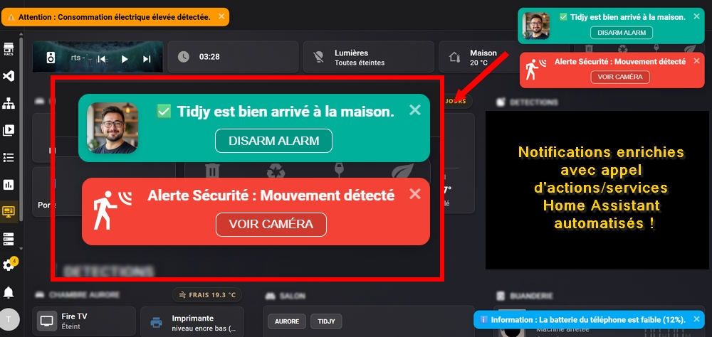

# Toastify 🍞

Intégration Toastify pour Home Assistant permettant d'afficher de superbes notifications de type "Toast" sur votre interface, en utilisant la bibliothèque [Toastify-js](https://apvarun.github.io/toastify-js/).

## ✨ Caractéristiques
- **HACS Ready** : Installation et mises à jour simplifiées.
- **Personnalisable** : Couleur, durée, position, icônes (avatars) et bouton de fermeture.
- **Contrastes Dynamiques** : Le texte s'adapte automatiquement (Noir ou Blanc) pour rester parfaitement lisible selon la couleur de fond choisie.
- **Visibilité Intelligente** : Choisissez d'afficher vos notifications uniquement sur le Dashboard ou dans tout Home Assistant (menus paramètres/systèmes, journaux, historique, etc.).
- **Actions Interactives** : Cliquez sur un toast pour ouvrir une URL ou **appeler un service Home Assistant** (ex: éteindre une lumière ou rediriger vers un dashboard).
- **Utilise le service Notify** : Totalement compatible avec le système de notification natif de Home Assistant.



## 📦 Installation

### 1. Via HACS (Recommandé)
1. Ouvrez **HACS** dans votre instance Home Assistant.
2. Cliquez sur les 3 points en haut à droite > **Dépôts personnalisés**.
3. Ajoutez l'URL de ce dépôt : `https://github.com/TidjyDev/HA-Toastify`.
4. Sélectionnez la catégorie **Intégration** et cliquez sur **Ajouter**.
5. Recherchez "Toastify" et installez-le.
6. **Redémarrez Home Assistant.**

### 2. Configuration
Ajoutez ces lignes à votre fichier `configuration.yaml` pour activer le moteur d'injection et déclarer le service de notification :

```yaml
# configuration.yaml : Déclaration du service de notifications toast
notify:
  - platform: toastify
    name: toastify
```

## 🛠️ Paramètres du service (`data:`)

| Paramètre | Description | Défaut |
| :--- | :--- | :--- |
| `message` | Le texte à afficher dans la notification. | (Requis) |
| `color` | Thème (`success`, `info`, `warning`, `error`) ou code Hex (`#FFFFFF`). | `info` |
| `duration` | Durée en ms (`3000` = 3s). Utilisez `-1` pour un toast persistant. | `3000` |
| `position` | Alignement horizontal : `left`, `center` ou `right`. | `right` |
| `gravity` | Alignement vertical : `top` ou `bottom`. | `top` |
| `close` | Affiche une croix de fermeture (`true` / `false`). | `false` |
| `icon` | URL d'une image ou d'un avatar (ex: `/local/avatar.png`) ou icône MDI. | 
| `oldestFirst` | Ordre des notifications lors de l'empilement | `true` |
| `visibility` | `dashboard` (Lovelace seul) ou `all` (Partout dans HA). | `dashboard` |
| `onClick` | Action au clic sur le toast : Appel de service HA (ex: `action: light.turn_off`) ou URL (/lovelace/0). | (ex: switch.toggle) |
| `callback` | Action à la fermeture du toast : Appel de service HA (ex: light.turn_off) ou URL (/lovelace/0). | (ex: light.turn_on) |
| `action_data` | Données pour l'appel de services HA. Appelé en paramètre `onClick` ou `callback`. | Dictionnaire YAML (ex: `entity_id: light.salon`). |
| `button_label` | Label du bouton `onClick` | "Voir"


Hormis pour les paramètre `visibility`, `action_data` et `button_label` propres à Home Assistant, vous pouvez vous référer à la documentation de la librairie Toastify : https://github.com/apvarun/toastify-js pour la définition complète des paramètres.

## 💡 Exemples YAML

### Notification de succès (Vert avec gradient)
Parfait pour confirmer qu'une automatisation s'est bien déroulée.
```yaml
service: notify.toastify
data:
  message: "Alarme activée avec succès"
  data:
    color: "success"
    position: "center"
    duration: 5000
```

### Notification d'alerte partout dans Home Assistant (Rouge avec bouton fermer)
Idéal pour les erreurs ou les alertes de sécurité qui nécessitent une attention immédiate.
Visible même dans les menus de configuration.
```yaml
service: notify.toastify
data:
  message: "⚠️ Fuite d'eau détectée dans la cuisine !"
  data:
    color: "#ff5f6d"
    close: true
    duration: -1
    gravity: "bottom"
    visibility: "all"
```

### Notification avec Icône (Avatar)
Pour savoir qui ou quoi a déclenché l'événement.
```yaml
service: notify.toastify
data:
  message: "Tidjy est arrivé à la maison"
  data:
    icon: "/local/img/tidjy_avatar.png"
    color: "#2196F3"
    duration: 6000
```

### Appel de service au clic (Fermer le portail)
Cet exemple montre comment déclencher une action physique dans ta maison simplement en cliquant sur la notification.
```yaml
service: notify.toastify
data:
  message: "Le portail est resté ouvert ! Cliquer pour fermer."
  data:
    color: warning
    onClick: 
      action: cover.close_cover
      action_data:
        entity_id: cover.portail_principal
    visibility: all
    close: true
    duration: -1
```

### Lien de navigation (Ouvrir les caméras)
Idéal pour rediriger instantanément l'utilisateur vers une vue spécifique de son interface Lovelace lors d'un événement.

```yaml
service: notify.toastify
data:
  message: "Mouvement détecté au jardin 🚨"
  data:
    color: "error"
    onClick: "/lovelace-mobile/cameras"
    icon: "/local/img/cam_icon.png"
    visibility: "all"
    duration: 8000
```

---
*Développé avec ❤️ pour la communauté Home Assistant.*
